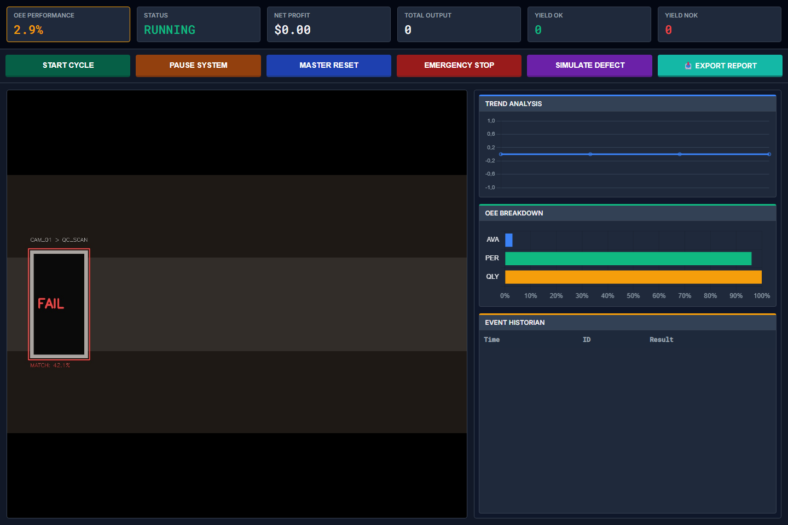

# Visual QC Project

Visual QC Project is an industrial computer-vision support case study for steel surface inspection. It combines two portfolio layers in one repo:

- a Flask-based operator workflow with historian logging, KPI tracking, and Excel export
- a real NEU-CLS defect-classification benchmark with measurable evaluation and review-queue logic

Demo: [Portfolio project entry](https://senanur-cetin.vercel.app/projects/visual-qc-project)

Short video demo: [`docs/assets/visual-qc-dashboard.webm`](docs/assets/visual-qc-dashboard.webm)



Portfolio role: `support case study`

## Why this project exists

Manufacturing inspection projects are rarely valuable as model output alone. Quality teams still need traceability, pass/fail context, KPI visibility, and a practical path for human review when model confidence drops.

This repo exists to show both sides:

- workflow design for operator-facing quality systems
- measurable CV evaluation that can stand up in DS and applied-AI interviews

## Case-study frame

### Problem

Steel surface inspection needs more than a classifier. A useful system has to route uncertain cases, preserve a production log, and export reviewable evidence for quality teams.

### Business context

In manufacturing, the output is not only a label. It is a decision surface: which units can move forward automatically, which ones need escalation, and how the line records that decision.

### Data or signal source

- Workflow layer: simulated live inspection feed, unit events, OEE updates, and SQLite historian logs
- DS layer: `NEU-CLS` public steel defect dataset with `1,800` grayscale images across six defect classes

### Methodology

- Feature pipeline: `64x64` grayscale HOG descriptors
- Benchmarks:
  - dummy baseline
  - logistic regression
  - random forest
- Evaluation:
  - deterministic `80/20` stratified holdout
  - accuracy, macro precision, macro recall, macro F1
  - confidence-based review queue

## Key results

From [`docs/data/neu-cls-case-study/summary.json`](docs/data/neu-cls-case-study/summary.json):

- Final model: `random forest on HOG descriptors`
- Accuracy: `0.8167`
- Macro precision: `0.8163`
- Macro recall: `0.8167`
- Macro F1: `0.8093`
- Review queue outcome: the `15%` lowest-confidence predictions capture `33.3%` of routing errors with `2.22x` better error yield than random review

From [`docs/data/neu-cls-case-study/benchmark-comparison.json`](docs/data/neu-cls-case-study/benchmark-comparison.json):

- Dummy baseline macro F1: `0.0476`
- Logistic regression macro F1: `0.7019`
- Random forest macro F1: `0.8093`

## What it does

- Simulates an inspection line with an operator-facing HMI
- Streams a synthetic vision feed for monitoring
- Tracks OEE, output, and yield metrics
- Stores timestamped production events in SQLite
- Exports Excel reports for QA review
- Publishes a real CV case-study surface at `/case-study`

## Stack

- Python
- Flask
- OpenCV
- scikit-learn
- Pandas
- SQLite
- XlsxWriter

## Architecture snapshot

- **Application shell:** Flask HMI for inspection workflow, historian logs, and export
- **Vision workflow layer:** synthetic OpenCV inspection feed used for operator monitoring
- **Analysis layer:** reproducible HOG plus scikit-learn benchmark on NEU-CLS
- **Persistence layer:** SQLite production historian
- **Proof layer:** JSON evaluation artifacts, hiring summary, and public case-study route

## Public proof surfaces

- Case-study notes: [`docs/case-study.md`](docs/case-study.md)
- Hiring summary: [`docs/hiring-summary.md`](docs/hiring-summary.md)
- Analysis notes: [`analysis/README.md`](analysis/README.md)
- Metrics artifacts: [`docs/data/neu-cls-case-study`](docs/data/neu-cls-case-study)
- Local route: `http://localhost:8080/case-study`

## What this proves

- You can package industrial computer vision into a workflow that quality stakeholders can actually use.
- You can benchmark a real surface-defect dataset and explain model tradeoffs instead of shipping a dashboard-only demo.
- You can translate model confidence into a review-queue decision rule rather than overclaiming automation.

## Local setup

```bash
python -m venv .venv
.venv\Scripts\activate
pip install -r requirements.txt
python analysis/run_neu_case_study.py
python main.py
```

The app runs on `http://localhost:8080`.

## Quality checks

```bash
python analysis/run_neu_case_study.py
python -m py_compile main.py case_study.py analysis/run_neu_case_study.py
python -m unittest discover -s tests -v
python -c "import main; print(main.app.name)"
```

## Limitations

- The live workflow layer still uses a simulated feed rather than a deployed inference service.
- The benchmark uses a balanced public dataset, so plant-specific imbalance and line drift are not represented.
- The published model is a classical CV baseline, not a production deep-learning stack.

## Portfolio note

This repository now sits above a toy CV demo but below a plant-ready deployment. The correct framing is: portfolio-grade industrial computer-vision case study with a real benchmark, review-queue logic, and operator workflow packaging.

## License

MIT
