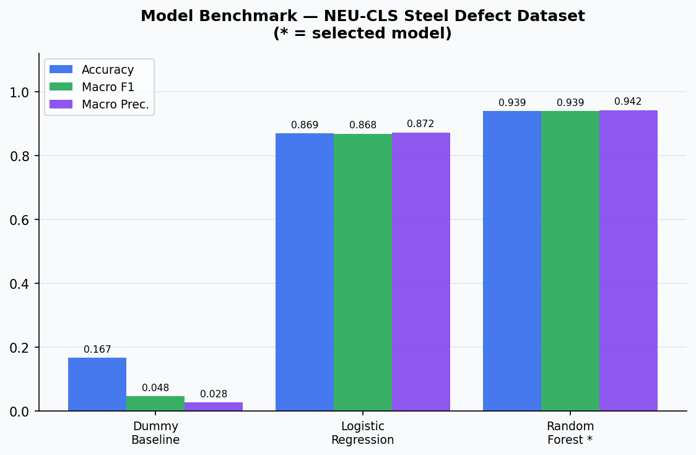
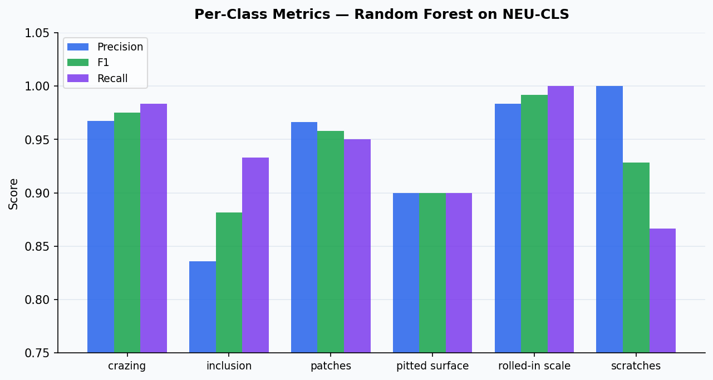
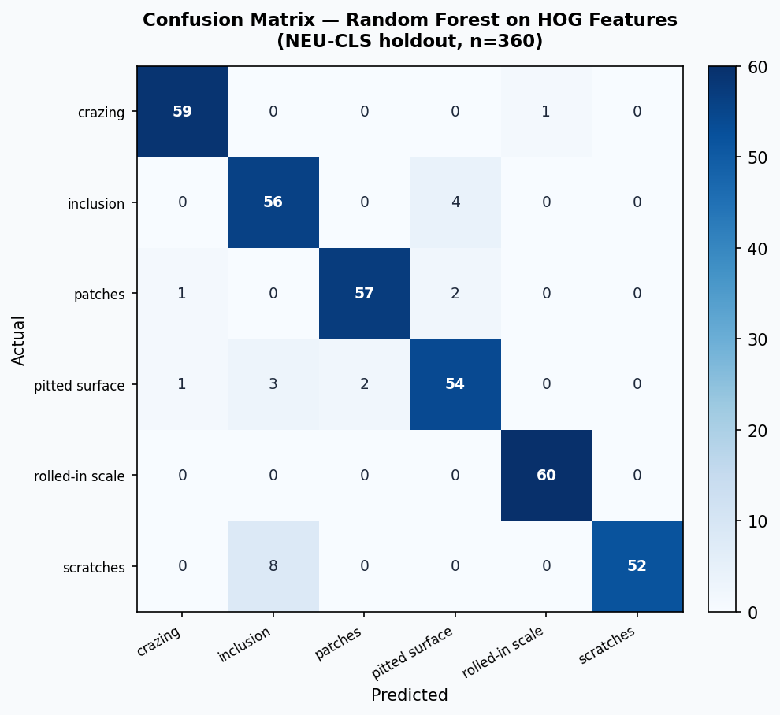
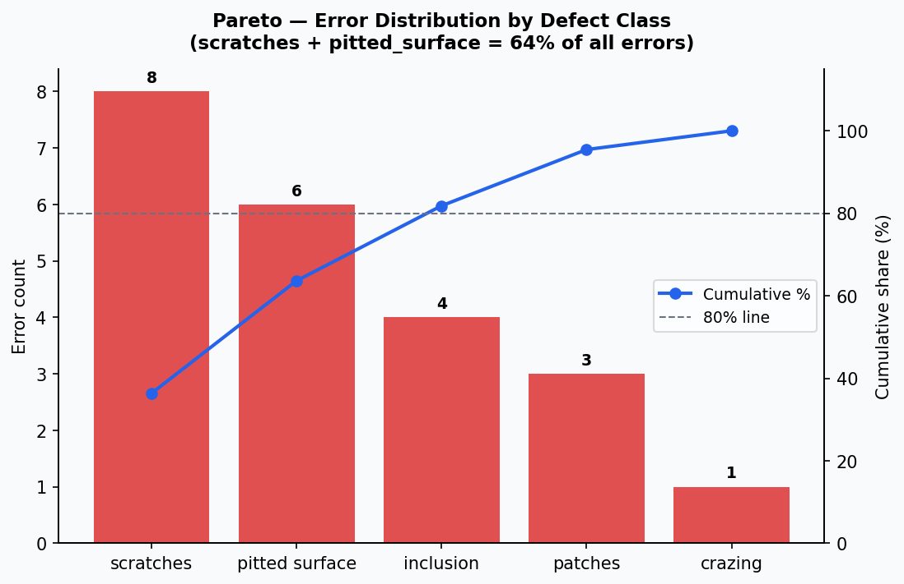
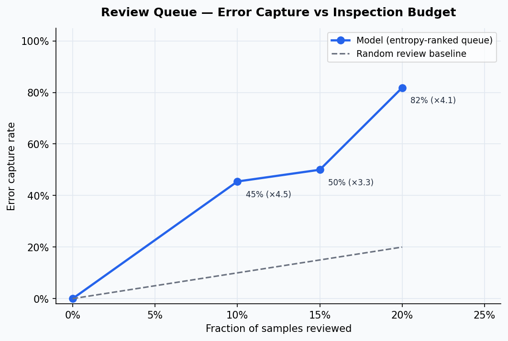

# Visual QC Project

[](https://github.com/senanurcetin/visual-qc-project/actions/workflows/ci.yml)


**Computer vision analytics case study** — steel surface defect classification on the NEU-CLS dataset, combined with an operator-facing Flask QA dashboard. Covers EDA, feature engineering (HOG), model benchmarking, per-class metrics, Pareto error analysis, and confidence-based review queue design.

Demo: [Portfolio project entry](https://senanur-cetin.vercel.app/projects/visual-qc-project)

Short video: [`docs/assets/visual-qc-dashboard.webm`](docs/assets/visual-qc-dashboard.webm)


---

## Problem

Steel surface inspection needs more than a classifier. A useful system must route uncertain cases, preserve a production log, and export reviewable evidence for quality teams. The model output is a decision surface — not just a label.

---

## Dataset

| Property | Value |
|----------|-------|
| Source | [NEU-CLS Steel Surface Defect Dataset](http://faculty.neu.edu.cn/yunhyan/NEU_surface_defect_database.html) |
| Images | 1,800 grayscale images |
| Classes | 6 defect types, perfectly balanced (300 per class) |
| Evaluation | Deterministic 80/20 stratified holdout (seed=42) |
| Feature pipeline | 64×64 HOG descriptors + Gabor filter bank + grid statistics |

### Defect Classes

| Class | Description |
|-------|-------------|
| Crazing | Micro-crack patterns — surface fatigue and coating stress |
| Inclusion | Foreign material trapped in the strip surface |
| Patches | Irregular patches — often require operator review before shipment |
| Pitted surface | Localized pitting — corrosion risk |
| Rolled-in scale | Scale rolled into strip — persistent texture distortion |
| Scratches | Linear scoring defects — commonly drive rework or rejection |

---

## Model Benchmark



| Model | Accuracy | Macro F1 | Macro Precision |
|-------|----------|----------|-----------------|
| Dummy baseline | 0.167 | 0.048 | 0.028 |
| Logistic regression | 0.869 | 0.868 | 0.872 |
| **Random Forest (selected)** | **0.939** | **0.939** | **0.942** |

Random forest on HOG + Gabor + grid features selected for highest accuracy and balanced per-class performance.

---

## Per-Class Metrics



| Class | Precision | Recall | F1 | FN Cost |
|-------|-----------|--------|----|---------|
| Crazing | 0.967 | 0.983 | 0.975 | $100 |
| Inclusion | 0.836 | 0.933 | 0.882 | $500 ← highest cost |
| Patches | 0.966 | 0.950 | 0.958 | $200 |
| Pitted surface | 0.900 | 0.900 | 0.900 | $350 |
| Rolled-in scale | 0.984 | 1.000 | 0.992 | $400 |
| Scratches | 1.000 | 0.867 | 0.929 | $150 |

Inclusion has the lowest precision/recall and the highest false-negative cost — the primary target for the review queue.

---

## Confusion Matrix



22 total errors out of 360 holdout samples (6.1% error rate). Main confusion hotspot: **scratches → inclusion** (8 cases). Second: **inclusion → pitted_surface** (4 cases).

---

## Pareto Error Analysis



| Class | Errors | Share | Cumulative |
|-------|--------|-------|-----------|
| Scratches | 8 | 36.4% | 36.4% |
| Pitted surface | 6 | 27.3% | 63.6% |
| Inclusion | 4 | 18.2% | 81.8% |
| Patches | 3 | 13.6% | 95.5% |
| Crazing | 1 | 4.5% | 100% |

**Two classes (scratches + pitted_surface) account for 64% of all errors** — prioritizing inspection budget on these two classes maximises defect capture.

---

## Review Queue — Confidence-Based Routing



Samples ranked by prediction entropy (high entropy = low confidence = route to human review):

| Budget | Samples reviewed | Errors captured | Yield lift vs random |
|--------|-----------------|-----------------|---------------------|
| 10% (36 samples) | 36 | 45.5% | **4.5×** |
| 15% (54 samples) | 54 | 50.0% | 3.3× |
| 20% (72 samples) | 72 | 81.8% | **4.1×** |

Reviewing the top 20% highest-entropy samples captures 82% of all defects at 4× better yield than random inspection.

---

## Stack

| Layer | Technology |
|-------|-----------|
| Feature engineering | Python, NumPy, scikit-image (HOG, Gabor) |
| Modeling | scikit-learn (Random Forest, Logistic Regression) |
| Dashboard | Flask, SQLite historian, Excel export |
| Visualization | Matplotlib |
| CI | GitHub Actions |

---

## Architecture

```
NEU-CLS Dataset (1,800 images)
        |
        v
Feature Extraction (HOG + Gabor + grid stats)
        |
        v
Model Benchmark (dummy / logistic / random forest)
        |
        v
Review Queue Design (entropy-ranked routing)
        |
        v
Flask Dashboard (operator UI + historian + export)
```

---

## Local Setup

```bash
python -m venv .venv
# Windows:  .venv\Scripts\activate
# macOS/Linux:  source .venv/bin/activate

pip install -r requirements.txt

# Run full analysis benchmark (downloads NEU-CLS dataset on first run)
python analysis/run_neu_case_study.py

# Start the dashboard
python main.py
```

App: `http://127.0.0.1:8080` | Case-study route: `http://127.0.0.1:8080/case-study`

---

## Tests

```bash
python -m unittest discover -s tests -v
python -m py_compile main.py case_study.py analysis/run_neu_case_study.py
```

---

## Proof Surfaces

| Document | Contents |
|----------|----------|
| [`docs/case-study.md`](docs/case-study.md) | Full methodology, results, limitations |
| [`docs/hiring-summary.md`](docs/hiring-summary.md) | Recruiter-facing one-page summary |
| [`docs/data/neu-cls-case-study/`](docs/data/neu-cls-case-study/) | JSON artifacts — metrics, confusion matrix, Pareto, review queue |

---

## What This Proves

- Multi-class image classification with imbalanced error costs — recall is not enough, per-class cost weighting matters
- Pareto analysis identifies which defect classes to prioritise in inspection budget
- Entropy-based review queue captures 82% of errors by reviewing only 20% of samples
- Business framing: connects model output to quality decision routing, not just label prediction

---

## Limitations

- HOG + Gabor descriptors are handcrafted — deep learning (ResNet, EfficientNet) would likely improve accuracy further
- NEU-CLS is a research benchmark — results are not directly transferable to a live production line
- The Flask dashboard uses a simulated inspection feed, not a real camera stream

---

## License

MIT
