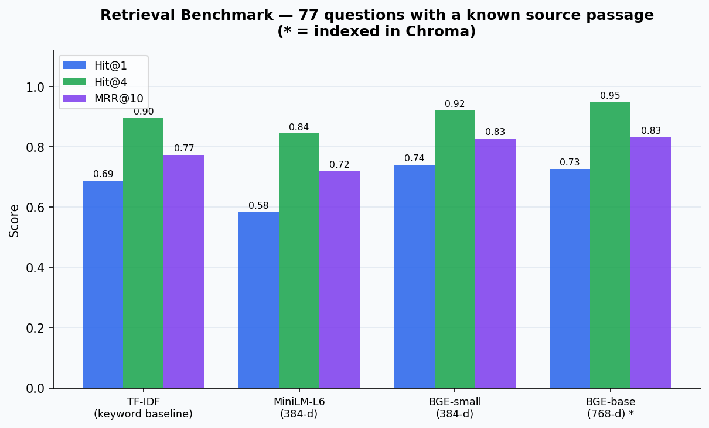
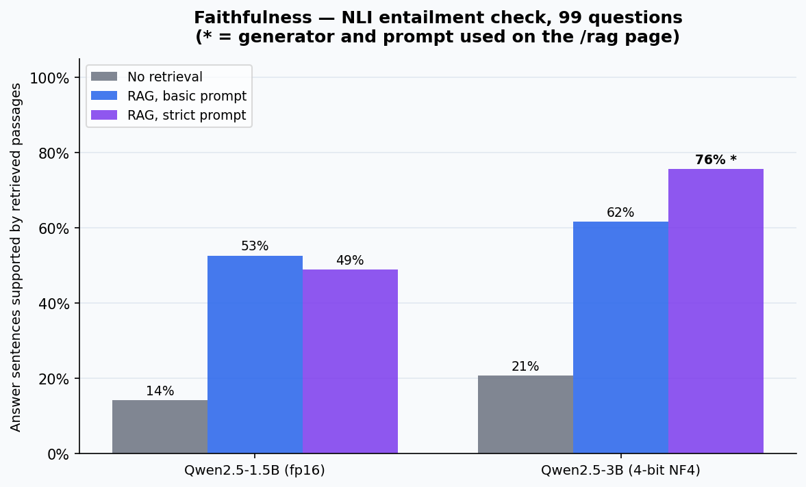

# Steel QC Knowledge Assistant: RAG Case Study

## Why this layer exists

The computer-vision case study classifies steel surface defects. A quality team also needs answers to process questions: what causes mill scale, when a control chart signals a special cause, how magnetic particle inspection works. This layer adds a retrieval-augmented assistant for those questions and, more importantly, measures it:

- **Retrieval quality**: does the system find the passage that actually answers the question?
- **Faithfulness**: is each sentence of the generated answer supported by the passages it retrieved?
- **Projection fidelity**: how much does the 3D picture of the embedding space distort what the system really does?

Everything runs locally on one laptop GPU. No paid API is called, and no key ships with the page.

## System

```
43 Wikipedia articles (CC BY-SA)
        |  section-aware chunking (~140 words)
        v
728 passages ──> BGE-base-en-v1.5 embeddings (768-d) ──> Chroma (HNSW, cosine)
                                                              |
question ──> same embedding model ──> top-4 passages ─────────┘
        |
        v
local LLM answers with citations ──> NLI claim check (faithfulness)
        |
        v
UMAP 3D / 2D map + precomputed example questions (/rag page)
```

| Component | Choice | Why |
|-----------|--------|-----|
| Knowledge base | 43 English Wikipedia articles in 6 topics, pinned to revision ids | Real, licensed text a steel QC team touches: defects, rolling, corrosion, SPC, NDT, machine vision |
| Chunking | Sentence packing to ~140 words (max 200), never crossing a section; max 32 passages per article | Keeps passages self-contained and stops long articles from dominating |
| Embeddings | `BAAI/bge-base-en-v1.5`, selected by benchmark (below) | Best MRR@10 of three models |
| Vector database | Chroma, HNSW index, cosine space | Chroma's top-4 matched exact search on 100% of 99 queries |
| Generators compared | `Qwen/Qwen2.5-1.5B-Instruct` (fp16) and `Qwen/Qwen2.5-3B-Instruct` (4-bit NF4) | Fit a 6 GB GPU; chosen by measured faithfulness |
| Faithfulness judge | `cross-encoder/nli-deberta-v3-base` | Open NLI model; checks entailment sentence by sentence |
| Projection | UMAP (cosine, 15 neighbours, min_dist 0.4), fitted on passages; questions placed with the fitted transform | Preserves local neighbourhoods far better than PCA (below) |

## Evaluation set

Two question sets, both published in [`eval-set.json`](data/rag-knowledge-assistant/eval-set.json):

- **77 generated questions with a known source passage.** Two passages of at least 70 words were sampled per article (seed 42) and Qwen2.5-1.5B wrote one question per passage. 86 were generated and 77 passed the filter (self-contained, ends with "?", no "the passage"). Retrieval is scored at passage level: the exact source passage must come back. Mean lexical overlap between question and source passage is 0.56, so many questions reuse the passage's key terms, which favours keyword search.
- **22 hand-written questions labelled at article level.** Operator-style questions (for example *"What is the difference between hot rolling and cold rolling of steel?"*), each labelled with the article(s) that answer it. The first six are the example questions on the `/rag` page.

## Retrieval results



| Retriever | Hit@1 | Hit@4 | MRR@10 | Hand-written: right article @1 |
|-----------|-------|-------|--------|-------------------------------|
| TF-IDF keyword baseline | 0.688 | 0.896 | 0.773 | 0.955 |
| MiniLM-L6 (384-d) | 0.584 | 0.844 | 0.720 | 0.955 |
| BGE-small (384-d) | 0.740 | 0.922 | 0.828 | 0.955 |
| **BGE-base (768-d), selected** | 0.727 | **0.948** | **0.833** | **1.000** |

- BGE-base puts the exact source passage in the top 4 for 94.8% of generated questions (TF-IDF: 89.6%). Top 4 is what the LLM actually reads.
- The keyword baseline is strong here because generated questions borrow the passage's wording. A small, older embedding model (MiniLM) loses to it. Choosing a retriever without a baseline would have hidden that.
- On the hand-written questions every retriever finds the right article in the top 5. That set is easier at article level and too small to separate the models; it mainly guards against the generated set being unrepresentative.

## Generation and faithfulness



**How faithfulness is scored.** Each answer is split into sentences (citations removed, fragments under four words dropped). A sentence counts as *supported* when the NLI model gives entailment ≥ 0.5 against at least one 1–3 sentence window of the four retrieved passages. Scoring against windows instead of whole passages matters: MNLI-trained models under-score entailment when the premise is a 150–200 word passage. Two example sentences that closely restate a passage (on mill scale composition and on passive-film breakdown in pitting) scored 0.018 and 0.003 against the whole passage, and 0.997 against the matching window.

**Control.** The same model answers the same questions without retrieval, and those answers are scored against the same passages. This separates "the answer is grounded in what was retrieved" from "the answer happens to agree with Wikipedia".

**Results (99 questions: 77 generated + 22 hand-written).**

| Generator | Prompt | Sentences supported | Mean faithfulness per answer | Fully supported answers | Declined |
|-----------|--------|--------------------|------------------------------|-------------------------|----------|
| Qwen2.5-1.5B (fp16) | no retrieval (control) | 14.2% | 0.141 | 0.0% | 0.0% |
| Qwen2.5-1.5B (fp16) | basic | 52.7% | 0.543 | 24.2% | 0.0% |
| Qwen2.5-1.5B (fp16) | strict | 48.9% | 0.507 | 28.3% | 0.0% |
| Qwen2.5-3B (4-bit) | no retrieval (control) | 20.7% | 0.202 | 2.0% | 0.0% |
| Qwen2.5-3B (4-bit) | basic | 61.7% | 0.614 | 41.8% | 1.0% |
| **Qwen2.5-3B (4-bit)** | **strict (selected)** | **75.7%** | **0.785** | **70.1%** | 2.0% |

*Basic prompt:* answer only from the numbered passages and cite them. *Strict prompt:* additionally answer in English, forbid background knowledge and conclusions the passages do not state, and cite a passage for every sentence.

What the numbers say:

- **Retrieval is what grounds the answer.** For the selected model, 75.7% of sentences are entailed by the retrieved passages; the same model answering without retrieval reaches 20.7% against the same passages.
- **Prompt effects depend on the model.** The strict prompt lowered the 1.5B model's support from 52.7% to 48.9% but raised the 3B model's from 61.7% to 75.7%. The smaller model does not follow the "no background knowledge" instruction; the larger one does. The generator and prompt used on the page were picked by mean faithfulness, not by reading a few answers.
- **Hand-written questions are harder.** With the selected configuration, 80.2% of sentences are supported on generated questions and 62.2% on the hand-written ones, which are broader than any single passage.
- **Declining is sometimes the right answer.** For *"How can machine vision detect surface defects on a production line?"* all four passages come from the right article but describe machine vision in general, not defect detection, and the model answers *"I don't know based on the provided sources."* Without retrieval, the same model confidently describes a method the sources never mention.
- When the exact source passage is retrieved (73 of 77 generated questions), 82.1% of sentences are supported; when it is missed (4 questions), 40.0%. Four questions are too few to read much into the second number.

## The 3D map and its honesty check

The map on `/rag` shows every passage as a point in a UMAP projection of the 768-dimensional embedding space. Choosing an example question places the question with the same fitted UMAP transform, draws lines to the retrieved passages and makes them glow.

The glowing passages always come from the full-dimensional Chroma search, not from what looks closest in 3D. The page says this under the chart and quantifies the distortion:

| Check | UMAP 3D | UMAP 2D | PCA 3D |
|-------|---------|---------|--------|
| Trustworthiness, k = 10 (passage neighbourhoods preserved) | 0.992 | 0.991 | 0.910 |
| Real top-4 among the 4 points nearest the question on screen (mean of 99 questions) | 1.6 of 4 | 1.4 of 4 | — |

- Passage-to-passage neighbourhoods survive the projection well; UMAP clearly beats PCA here.
- Question-to-passage distances do not survive: in 3D, all four on-screen neighbours of a question are real results for only 2.0% of questions, and none are for 18.2%. A question is placed with UMAP's `transform`, which is an approximation for points the projection was not fitted on.
- This is why the highlighted passages come from the full-dimensional search. The page states the per-question overlap under the map, so a viewer never has to take the 3D distances on trust.

Performance: Three.js is loaded with a dynamic `import()` only when the map section is about to scroll into view (IntersectionObserver, 200 px margin). Phones (< 768 px), users with `prefers-reduced-motion`, and browsers without WebGL get a 2D canvas version drawn from a separate 2D UMAP fit. Desktop users can switch between the two.

## Reproduce

```bash
pip install -r requirements.txt -r requirements-rag.txt   # CUDA build of torch recommended
python analysis/run_rag_case_study.py      # fetch corpus, benchmark, index, generate, score, project
python analysis/generate_rag_visuals.py    # README charts from the JSON artifacts
python main.py                             # http://127.0.0.1:8080/rag
```

Model outputs, embeddings and the Wikipedia fetch are cached in `analysis/.cache/rag/`, so a re-run only recomputes what changed. All published numbers live in [`docs/data/rag-knowledge-assistant/`](data/rag-knowledge-assistant/).

## Limitations

- Generated questions come from single passages, which makes retrieval easier than real user questions. The hand-written set is small (22).
- Some generated questions are generic enough that several passages answer them; passage-level Hit@k counts those as misses, so it is a conservative measure.
- Faithfulness is not correctness. A supported sentence can still be an incomplete answer, and the NLI judge has its own errors, especially on paraphrase and on numbers.
- Small local generators add background knowledge the sources do not state. The claim check on the page shows this sentence by sentence instead of hiding it.
- The knowledge base is encyclopaedic, not a plant's own SOPs or inspection records. This demonstrates the method, not a deployable assistant.
